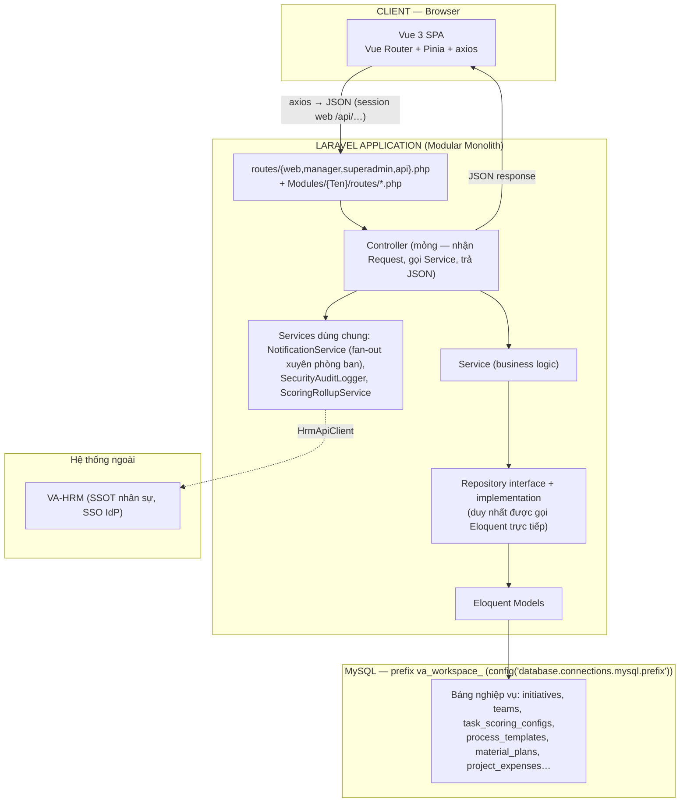
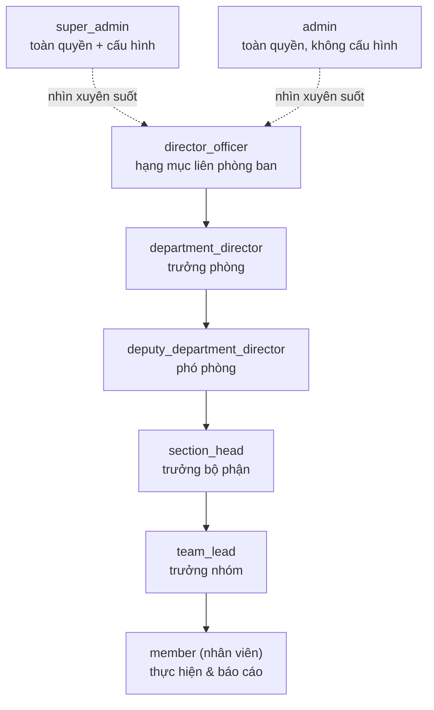
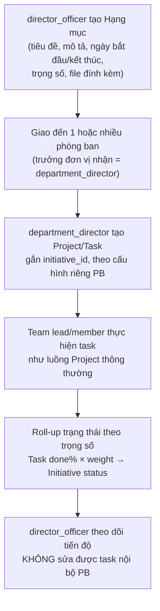
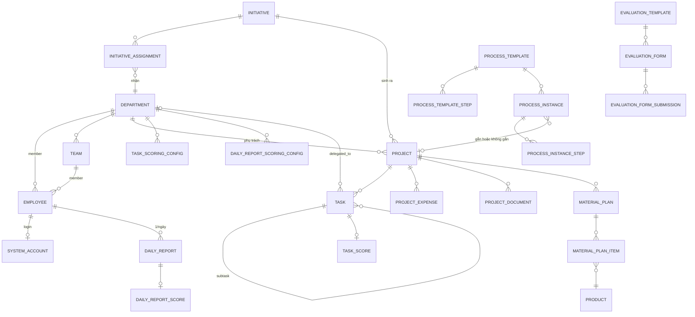
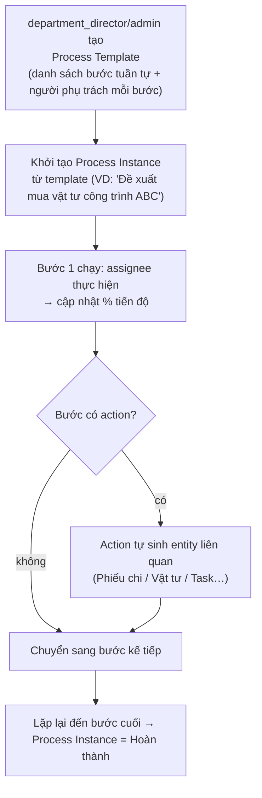

# TỔNG QUAN DỰ ÁN — VA WORKSPACE

> **VA Workspace** — nền tảng quản lý công việc, hiệu suất & KPI đa phòng ban, mỗi phòng ban tự cấu hình template điểm riêng, super-admin quản trị toàn hệ thống, hỗ trợ giao/nhận hạng mục và uỷ quyền công việc xuyên phòng ban.
>
> Tài liệu này là **bản overview tổng thể** cho toàn bộ hệ thống — bao gồm lõi quản lý dự án/công việc/hiệu suất, phân cấp vai trò tổ chức, entity Hạng mục (Initiative) chiến lược xuyên phòng ban, uỷ quyền task xuyên phòng ban, hệ chấm điểm hợp nhất, cùng các module quản trị dự án nâng cao: dự án — dashboard, workload, tài chính dự án, vật tư/dự toán, và quy trình/BPM.
>
> Đây là **tài liệu sống**: phần nền tảng đã có trong repo, phần nghiệp vụ (Project, Initiative, KPI…) vẫn là kế hoạch. Schema/route của các module chưa dựng là đề xuất theo `.claude/CLAUDE.md`.
>
> Cập nhật: 2026-08-26 — hoàn tất Evaluation Giai đoạn C (Mẫu đánh giá,
> PR1–PR6), xem `plans/2026-08-26-mau-danh-gia.md` và §21. Sửa cơ chế
> "Ẩn/hiện menu toàn hệ thống" (`WorkspaceConfig`) để áp dụng cho **mọi**
> tài khoản kể cả `super_admin` (bỏ ngoại lệ trước đây), và nâng cấp UI
> trang quản lý (tìm kiếm, lọc, thao tác hàng loạt, panel chi tiết).

---

## Trạng thái triển khai

Nền tảng **Phase 0 + Phase 1 đã xong**. Các module nghiệp vụ (Project, Initiative, DailyReport…) **chưa dựng**.

### Đã có trong repo

| Module | Đã chạy | Ghi chú quan trọng |
|---|---|---|
| `Identity` | Google SSO (Sanctum **session/cookie**, không Bearer stateless), User/Department (stub chờ HRM), **9 role**, RBAC engine + UI ma trận `/superadmin/permissions`, View-as, Team, nhật ký hoạt động, shortcut | Gộp Auth + Department + Team + một phần Audit/SystemConfig — **không** tách module riêng |
| `WorkspaceConfig` | Hub trưởng phòng: thành viên, CRUD nhóm, gán vai trò, bật/tắt menu; super_admin: overview + chi tiết phòng ban (chỉ xem) | Tab **Tiêu chí đánh giá** chưa có — đây là việc tiếp theo |
| `Social` | Bảng tin nội bộ: đăng bài (4 loại tường), cảm xúc, bình luận đa cấp, poll, nhóm, sticker, `@mention`, ghim, lượt xem, giới hạn hiển thị theo phòng ban | **Không nằm trong kế hoạch gốc** — dựng ngoài lộ trình §19, chưa có ở bản đồ §2 trước bản cập nhật này. Chi tiết: `docs/modules/Social.md` |
| `Example` | Module mẫu | Copy khi tạo module mới (`new-module`) |

**Quyết định đã chốt khi làm Identity/WorkspaceConfig (khác bản plan gốc):**

- **9 role**, không phải 7: thêm `deputy_department_director` (Phó phòng) và `section_head` (Trưởng bộ phận).
- **Team** thuộc `Identity` (sở hữu lâu dài của Workspace, `team_lead_id` không sync HRM). CRUD nhóm nằm trong tab Thành viên của WorkspaceConfig, không có trang `/manager/teams` riêng. `GET /manager/teams` chỉ còn dropdown cho ma trận phân quyền.
- **User/Department** vẫn stub local; khi HRM có API chỉ đổi binding Repository.
- JSON SPA của Identity/WorkspaceConfig đi middleware `web` + session (`/api/me`, `/api/workspace-config/*`), không dùng `routes/api.php` stateless — rủi ro §20.11 đã chốt.
- Trưởng phòng chỉ gán được: `deputy_department_director`, `section_head`, `team_lead`, `member`, `viewer` — **không** tự gán `super_admin` / `admin` / `director_officer` / `department_director`.

### Việc nên làm tiếp — đọc §21

**Bước kế tiếp: module `Evaluation` Giai đoạn C (Mẫu đánh giá)** — Giai đoạn B
(tab «Tiêu chí đánh giá» trong `WorkspaceConfigHub`) đã xong. Kế hoạch chi
tiết Giai đoạn C: `plans/2026-08-26-mau-danh-gia.md`. Không nhảy sang
Initiative/Project khi Evaluation còn dở.

---

## 0. Bối cảnh & nguyên tắc thiết kế

VA Workspace vận hành trong một tổ chức nhiều phòng ban, nơi công việc không chỉ nằm gọn trong 1 đơn vị mà thường xuyên cần phối hợp xuyên phòng ban — từ cấp lãnh đạo giao chủ đề chiến lược cho nhiều phòng ban cùng lúc, đến việc một phòng ban cần nhờ nhân sự phòng ban khác hỗ trợ một đầu việc cụ thể. Hệ thống được thiết kế theo các nguyên tắc nghiệp vụ sau ngay từ đầu:

1. **Phân cấp vai trò rõ ràng** (`director_officer` → `department_director` → `deputy_department_director` → `section_head` → `team_lead`) thay vì gộp chung một vai trò "quản lý".
2. **Hạng mục (Initiative)** là container chiến lược nằm trên Project, cho phép lãnh đạo giao một chủ đề cho nhiều phòng ban cùng lúc mà không cần Project phải gắn cứng vào 1 phòng ban duy nhất.
3. **Uỷ quyền công việc xuyên phòng ban (Cross-department Task Delegation)**: task tạo ở phòng ban A có thể giao trực tiếp cho người ở phòng ban B, trạng thái đồng bộ hai chiều, dữ liệu vẫn cô lập đúng phạm vi từng bên.
4. **Chấm điểm Task riêng theo từng phòng ban**, cùng pattern với chấm điểm Báo cáo ngày, để mỗi phòng ban tự cấu hình tiêu chí phù hợp nghiệp vụ của mình.
5. **KPI Dashboard hợp nhất có trọng số**, roll-up từ 3 nguồn điểm (Daily Report, Evaluation, Task Scoring) thành một công thức tổng hợp rõ ràng, cấu hình được theo phòng ban.
6. **Team** là đơn vị nhỏ nhất trong cấu trúc tổ chức, làm phạm vi (scope) hoạt động cho vai trò `team_lead`.
7. **Process Engine (Quy trình)** — BPM cấu hình được, mỗi bước gán người thực hiện và có thể tự sinh entity nghiệp vụ liên quan (phiếu chi, vật tư…), thay cho việc mô phỏng quy trình nhiều bước bằng các Task rời rạc.
8. **Project Finance** — theo dõi tổng giá trị dự án, chi phí thực chi, và dòng tiền theo thời gian thực, tách bạch với chi phí nhân công tính từ Worklog.
9. **Material/Supply Planning (Vật tư & Dự toán)** — lập kế hoạch vật tư theo phòng ban/tháng, gắn với danh mục sản phẩm dùng chung, phục vụ các phòng ban thuộc nhóm dự án BĐS/xây dựng/sản xuất.
10. **Task hỗ trợ WBS đa cấp không giới hạn độ sâu**, hiển thị trên Gantt có thanh cuộn thời gian.
11. **Document Manager tách 2 lớp**: thư mục tài liệu dự án do người dùng chủ động quản lý (`Tài liệu dự án`), và tập hợp tự động các file đính kèm từ Task (`Đính kèm công việc`).

**Nguyên tắc kiến trúc chung (bắt buộc — theo `.claude/CLAUDE.md`):**

- **Modular Monolith**: mỗi tính năng lớn là 1 module độc lập trong `Modules/{TenModule}/` (`nwidart/laravel-modules`), tự chứa backend lẫn frontend Vue riêng — chỉ những gì thực sự dùng chung nhiều module mới đặt ở `app/` cấp gốc.
- **Vue 3 SPA gọi API JSON** — không dùng Inertia.js, không server-render Vue qua Controller. Frontend (`resources/js/` gốc + `Modules/{Ten}/resources/js`) là SPA độc lập, điều hướng bằng Vue Router. JSON hiện tại đi middleware `web` + session (`/api/me`, `/api/workspace-config/*`…), không dùng `routes/api.php` stateless (đã chốt §20.11).
- **Controller → Service → Repository → Model** là pattern bắt buộc cho **mọi** module mới (xem §3), không có ngoại lệ "MVC thuần" hay "Clean Architecture riêng" như các dự án Inertia khác — thống nhất một pattern duy nhất trong toàn hệ thống.
- **4 file route cố định** ở cấp global (`web`, `manager`, `superadmin`, `api`) — module có thể có route riêng cùng tên nếu cần tách biệt nhưng mặc định ưu tiên đăng ký cấp global (xem §10).
- Chuẩn Import/Export 3-tab thống nhất, và RBAC theo mô hình matrix-grant OR ownership-grant (xem §4).

---

## 1. Bài toán & Mục tiêu

| # | Bài toán | Giải pháp (module trong `Modules/`) |
|---|---|---|
| 1 | Theo dõi tiến độ dự án phân tán | Project · Sprint · Task · Gantt · Calendar |
| 2 | Báo cáo ngày chuẩn hoá, chấm điểm | DailyReport — 5 tiêu chí, xếp loại A–F |
| 3 | Quản lý vướng mắc/rủi ro | Blocker |
| 4 | Kiểm thử QA chuẩn hoá | TestCase / Test Suite |
| 5 | Kênh phản hồi nhân viên | Feedback |
| 6 | Chi phí nhân công theo giờ | Worklog + `rate_snapshot` |
| 7 | Nhân sự theo phòng ban, đồng bộ HRM | Department + Employee (SSOT ở HRM) |
| 8 | Hợp đồng/NCC | Contract (Contract Lifecycle Management) |
| 9 | Mật khẩu hạ tầng có audit | Credential (Vault) |
| 10 | Hiệu suất nhân sự khách quan | Performance — roll-up 3 nguồn điểm |
| 11 | Tri thức nội bộ | KnowledgeBase |
| 12 | Tài khoản AI, chi phí | AiAccount |
| 13 | Việc cá nhân xuyên dự án, gồm cả task uỷ quyền từ phòng ban khác | MyWork (My Today's Work) |
| 14 | Audit trail bảo mật | Audit |
| 15 | Onboarding theo vai trò | Onboarding |
| 16 | Đánh giá nhân sự có form chuẩn | Evaluation (Config/Forms) |
| 17 | Báo cáo tuần tự động | WeeklyReport |
| 18 | Giao chủ đề/hạng mục chiến lược xuyên phòng ban, theo dõi roll-up tiến độ | Initiative (Hạng mục) |
| 19 | Một phòng ban giao việc trực tiếp cho người ở phòng ban khác, nhận lại trạng thái | Task Delegation (mở rộng module Project/Task) |
| 20 | Chấm điểm Task riêng theo từng phòng ban, gộp vào KPI tổng | TaskScoringConfig + KPI Rollup |
| 21 | Phân quyền theo chuỗi báo cáo tổ chức (không chỉ theo phòng ban phẳng) | RBAC — 9 role, scope = department/team |
| 22 | Chuẩn hoá quy trình nhiều bước có phê duyệt, mỗi bước tự sinh nghiệp vụ liên quan (phiếu chi, vật tư…) | ProcessEngine (Quy trình/BPM) |
| 23 | Theo dõi tổng giá trị dự án, chi phí thực chi, dòng tiền theo thời gian thực | ProjectFinance |
| 24 | Lập kế hoạch vật tư/dự toán theo phòng ban, sản phẩm, tháng | MaterialPlanning |
| 25 | Xem khối lượng công việc (workload) của từng nhân sự trong 1 dự án | Workload Dashboard (trong module Project) |
| 26 | Báo cáo hiệu suất theo dự án, tách đúng hạn/quá hạn cho cả việc đang làm và đã xong | Performance Report theo Project |
| 27 | Cấu hình cách tính tiến độ dự án (bình quân % task, theo trọng số phase…) | Project progress calculation strategy |

---

## 2. Bản đồ module (`Modules/`)

Đặt tên module theo PascalCase, alias kebab-case (xem `.claude/skills/new-module`). **Không** tạo thêm module `Auth` / `Department` / `SystemConfig` / `Audit` riêng — những phần đó đã nằm trong `Identity` (và một phần trong `WorkspaceConfig`).

```
VA Workspace
│
│  ── ĐÃ CÓ ─────────────────────────────────────────────────────────
├── Identity               SSO Google, User/Department (stub HRM), 9 role,
│                          RBAC + ma trận, View-as, Team, activity log, shortcut
├── WorkspaceConfig        Hub cấu hình phòng ban (thành viên, nhóm, menu)
│                          + overview super_admin (chỉ xem)
├── Social                 Bảng tin nội bộ — bài đăng/cảm xúc/bình luận/poll/
│                          nhóm/sticker/mention (ngoài lộ trình gốc, xem docs/modules/Social.md)
├── Example                Module mẫu — copy khi tạo module mới
│
│  ── KẾ HOẠCH (chưa dựng) ──────────────────────────────────────────
├── Evaluation             ★ việc tiếp theo — tiêu chí đánh giá (Giai đoạn B)
│                          rồi mẫu/phiếu (Giai đoạn C); tab trong WorkspaceConfigHub
├── Notification           Thông báo in-app — bắn được xuyên phòng ban
├── Project                Dự án · Sprint · Epic · Task (WBS đa cấp) · Worklog · Gantt
├── ProjectFinance         Tổng giá trị, đã chi, dòng tiền, ngân sách theo phase
├── DocumentManager        Tài liệu dự án (thư mục) tách biệt Đính kèm công việc
├── ProcessEngine          Quy trình BPM đa bước, action tự sinh entity
├── MaterialPlanning       Dự toán/kế hoạch vật tư theo phòng ban · sản phẩm · tháng
├── Initiative             Hạng mục liên phòng ban, roll-up trạng thái/trọng số
│   └── (Task Delegation mở rộng trực tiếp trong Project, không tách module riêng)
├── DailyReport            Báo cáo ngày: tạo → nộp → chấm điểm → xếp loại
├── RoutineTask            Việc thường xuyên/lặp lại
├── Blocker                Vướng mắc / rủi ro dự án
├── TestCase               QA / Test case theo dự án
├── Feedback               Góp ý & đề xuất từ nhân viên
├── Comment                Thảo luận đa hình (polymorphic, dùng chung)
├── TaskScoringConfig      Template chấm điểm Task theo từng phòng ban
│                          (tab thêm vào WorkspaceConfigHub, giống Evaluation)
├── Kpi                    Roll-up có trọng số từ Daily Report + Evaluation + Task Scoring
├── Profile                Hồ sơ cá nhân
├── AiAccount              Quản lý tài khoản AI
├── Dashboard              Tổng quan hệ thống + KPI compliance
├── MyWork                 Việc của tôi — gồm cả task uỷ quyền liên phòng ban
├── KnowledgeBase          Tri thức nội bộ
├── Contract               Quản lý hợp đồng, NCC (CLM)
├── Credential             Kho tài khoản/mật khẩu hạ tầng
├── Performance            Hiệu suất — nguồn dữ liệu cho KPI Dashboard
├── WeeklyReport           Báo cáo tuần Executive Dashboard
└── Onboarding             Tour tương tác theo vai trò (9 role)
```

> Tạo module mới: skill `new-module`, copy `Modules/Example/`. Model/migration/repository của **Team** và `department_sidebar_configs` đặt trong Identity; WorkspaceConfig chỉ có Controller/Service điều phối UI.

---

## 3. Kiến trúc hệ thống

Laravel 10 (Modular Monolith qua `nwidart/laravel-modules`) làm backend JSON API thuần; Vue 3 SPA độc lập (Vue Router + Pinia + axios) tiêu thụ API — **không dùng Inertia.js**, không có Controller nào render Vue trực tiếp. Blade chỉ dùng làm shell mount SPA (`resources/views/app.blade.php`).



**Quyết định kiến trúc — thống nhất 1 pattern cho toàn hệ thống (không phân nhánh Clean Architecture vs MVC như các dự án khác):**

- **Mọi module** — kể cả những module có state machine phức tạp (`Initiative`, `ProcessEngine`, `Project`/`Task` với WBS) — đều theo **Controller → Service → Repository → Model** (§4 CLAUDE.md). State machine (draft → assigned → in_progress → done…) được cài đặt là logic trong Service, không tách riêng layer Use Case/Domain.
- `Task Delegation` → mở rộng trực tiếp trong Service/Repository của module `Project` (field trên `tasks`, không tạo module riêng).
- `TaskScoringConfig` → module riêng, cùng pattern Controller→Service→Repository, tương tự `daily_report_scoring_configs` trong `WorkspaceConfig`.
- `ProcessEngine` action (`create_payment_voucher`, `create_material_plan`…) → Strategy pattern, mỗi action là 1 class riêng do `ProcessEngineServiceProvider` đăng ký, được `ProcessInstanceService` gọi — vẫn nằm trong layer Service, không phá vỡ pattern chung.
- Form Request riêng cho validate input ở mọi module; Controller không tự validate.

---

## 4. RBAC — Phân cấp vai trò

### 4.1 9 vai trò hệ thống

Nguồn sự thật trong code: `Modules/Identity/Database/Seeders/RoleSeeder.php` + `resources/js/constants/roles.js`.

| Role | Mô tả | Phạm vi (scope) | Vào ma trận phân quyền? | Hub cấu hình PB? |
|---|---|---|---|---|
| `super_admin` | God-mode, toàn quyền + độc quyền ma trận phân quyền | Toàn hệ thống | ✅ (duy nhất sửa) | Overview mọi PB (chỉ xem) |
| `admin` | Toàn quyền nghiệp vụ | Toàn hệ thống | ❌ | ❌ |
| `director_officer` | Giao Hạng mục liên phòng ban, đánh giá mục tiêu quý/tháng/năm | Đa phòng ban (không gắn cứng 1 PB) | ❌ | ❌ |
| `department_director` | Quản lý phòng ban: task, phân công, hub workspace của PB mình | 1 phòng ban | ❌ | ✅ (sửa) |
| `deputy_department_director` | Phó phòng — điều hành khi trưởng phòng vắng; quyền nghiệp vụ gần trưởng phòng | 1 phòng ban | ❌ | ✅ (sửa) |
| `section_head` | Trưởng bộ phận — task & nhân sự trong một bộ phận thuộc phòng ban | 1 bộ phận / phòng ban | ❌ | ❌ |
| `team_lead` | Quản lý task & thành viên trong 1 nhóm | 1 team trong phòng ban | ❌ | ❌ |
| `member` | Làm việc, viết báo cáo ngày, tạo test case/đề xuất/KB của mình | Cá nhân | ❌ | ❌ |
| `viewer` | Chỉ xem (dashboard, hiệu suất, hợp đồng, dự án) | Theo cấu hình | ❌ | ❌ |

Trưởng phòng **không** tự gán `super_admin` / `admin` / `director_officer` / `department_director`. Danh sách gán được: `WorkspaceConfigMemberService::ASSIGNABLE_ROLE_CODES`.



### 4.2 Nguyên tắc RBAC

**Quyền cuối cùng = (matrix-grant) OR (ownership/entity-grant).** Matrix-grant có thêm chiều **scope** (`global` / `department` / `team`) để phân quyền không chỉ theo module mà còn theo phạm vi tổ chức. `web.php`/`manager.php`/`superadmin.php`/`api.php` map trực tiếp vào 3 mức đầu của scope này (xem §10).

```
SystemAccount::allows('module.action', scope?)
  → Hierarchy: '*' → '{module}.*' → exact key
  → nếu scope=department: chỉ áp dụng trong phạm vi phòng ban của user
  → nếu scope=team: chỉ áp dụng trong phạm vi team của user
```

**Reserved keys** (chỉ `super_admin`, xem `config/permissions.php`): `system.settings.*`, `permissions.manage`, `roles.assign`, `workspace.hub.manage`, `workspace.evaluation.*`, `workspace.daily_report_scoring.*`, `workspace.task_scoring.*`, `workspace_config.view_all`, `initiative.assign_department` (ngoại lệ: cấp cho `director_officer` trở lên).

### 4.3 Ma trận quyền theo module (tóm tắt)

| Module | super_admin | admin | director_officer | department_director / phó phòng | team_lead | member |
|---|---|---|---|---|---|---|
| Cấu hình template điểm toàn hệ thống (Daily Report / Evaluation / Task) | ✅ | ❌ | ❌ | ❌ | ❌ | ❌ |
| Hub cấu hình phòng ban (thành viên, nhóm, menu) | xem tổng hợp | ❌ | ❌ | ✅ | ❌ | ❌ |
| Tạo & giao Hạng mục xuyên PB | ✅ | ✅ | ✅ | ❌ | ❌ | ❌ |
| Xem tiến độ Hạng mục (roll-up) | ✅ | ✅ | ✅ (của mình) | ✅ (PB nhận) | ❌ | ❌ |
| Tạo Project/Task trong PB | ✅ | ✅ | ❌ | ✅ | ✅ (trong team) | ❌ |
| Giao task xuyên phòng ban (delegation) | ✅ | ✅ | ✅ | ✅ | ✅ | ❌ |
| Duyệt/chấm điểm Daily Report | ✅ | ✅ | ❌ | ✅ | ✅ | ❌ |
| Viết Daily Report của bản thân | ✅ | ✅ | ✅ | ✅ | ✅ | ✅ |
| Xem KPI Dashboard toàn hệ thống | ✅ | ✅ | ✅ (PB liên quan) | ✅ (PB mình) | ✅ (team mình) | ❌ |
| Xem KPI cá nhân | ✅ | ✅ | ✅ | ✅ | ✅ | ✅ |

> `section_head` nằm giữa phó phòng và `team_lead` (tạo/giao task, không vào hub WorkspaceConfig). Ma trận mặc định đầy đủ: `config/permissions.php`.

---

## 5. Entity: Hạng mục (Initiative)

### 5.1 Luồng nghiệp vụ



### 5.2 Schema đề xuất

```
initiatives
  id, code (HM-001), title, description,
  start_date, end_date, status (draft/assigned/in_progress/done/cancelled),
  weight (trọng số tổng), created_by (director_officer_id),
  created_at, updated_at

initiative_attachments
  id, initiative_id, file_path, uploaded_by, uploaded_at

initiative_assignments
  id, initiative_id, department_id, assigned_to (employee_id — trưởng đơn vị nhận),
  weight_in_initiative, status (nhận/đang xử lý/hoàn thành),
  progress_percent (roll-up từ project/task con), responded_at

projects
  id, ..., initiative_id (nullable FK → initiatives.id)
```

> Bảng thuộc module `Initiative` được tạo trong `Modules/Initiative/Database/migrations/` — Laravel tự thêm prefix `va_workspace_` từ `config('database.connections.mysql.prefix')`, **không** tự gõ prefix vào tên bảng trong migration.

### 5.3 Business rule

- 1 Hạng mục **có thể** giao cho nhiều phòng ban cùng lúc, mỗi phòng ban có `weight_in_initiative` riêng (tổng = 100%).
- `initiative_assignments.progress_percent` = trung bình có trọng số `% hoàn thành` của các Project/Task con thuộc `department_id` đó và `initiative_id` đó.
- `initiatives.status` tự động chuyển `done` khi tất cả `initiative_assignments` đạt `progress_percent = 100`.
- `director_officer` chỉ có quyền đọc (read-only) trên Project/Task con — không có quyền sửa, để tách bạch trách nhiệm quản trị.
- Logic roll-up nằm trong `InitiativeService` (module `Initiative`), đọc dữ liệu Project/Task qua `ProjectRepositoryInterface`/`TaskRepositoryInterface` do module `Project` expose — **không** query trực tiếp bảng `tasks` từ module `Initiative`.

---

## 6. Cross-department Task Delegation

### 6.1 Schema đề xuất

```
tasks
  id, ...,
  origin_department_id (department tạo task — mặc định = department của project),
  delegated_to_department_id (nullable — nếu task được giao cho người ở PB khác),
  delegated_to_employee_id (nullable),
  delegation_status (pending/accepted/in_progress/done/rejected)
```

### 6.2 Luồng

1. Người có quyền giao task (từ `team_lead` trở lên) chọn assignee thuộc phòng ban khác → `TaskService::delegate()` set `delegated_to_department_id` + `delegated_to_employee_id` qua `TaskRepositoryInterface`.
2. Task xuất hiện trong **My Today's Work** (module `MyWork`) của người nhận, kèm badge "Giao từ [tên PB nguồn]".
3. Người nhận cập nhật `delegation_status` / tiến độ như task thường (vẫn qua endpoint của module `Project` trong `routes/api.php`).
4. `NotificationService` (service dùng chung, đăng ký ở `app/Providers`) bắn thông báo về watcher tại **phòng ban nguồn** mỗi khi `delegation_status` đổi.
5. Phân quyền: người ở PB nhận chỉ thấy đúng task được giao (ownership-grant) — **không** thấy toàn bộ Project nội bộ của PB nguồn, giữ nguyên tắc cô lập dữ liệu.

---

## 7. Hệ chấm điểm hợp nhất & KPI Dashboard

### 7.1 3 hệ điểm theo phòng ban

| Hệ điểm | Bảng cấu hình | Module | Áp dụng cho | Kỳ |
|---|---|---|---|---|
| Daily Report | `daily_report_scoring_configs` | `WorkspaceConfig` | Báo cáo ngày — 5 tiêu chí | Ngày |
| Evaluation | `evaluation_criteria` + `evaluation_templates` (Giai đoạn C, kế hoạch) | `Evaluation` | Đánh giá nhân sự định kỳ | Quý/Tháng/Năm |
| Task Scoring | `task_scoring_configs` | `TaskScoringConfig` | Từng Task hoàn thành | Theo task |

> `evaluation_templates` (Mẫu đánh giá — Giai đoạn C) gộp nhiều
> `evaluation_criteria` thành 1 bộ có trọng số, gán được cho "Vị trí đánh
> giá" và có thể đánh dấu dùng chung toàn hệ thống. Schema đề xuất chi tiết:
> `plans/2026-08-26-mau-danh-gia.md` §4. Chưa có phiếu đánh giá thực tế
> (Giai đoạn D).

### 7.2 Schema `task_scoring_configs`

```
task_scoring_configs
  id, department_id, criteria_key (VD: deadline_compliance, quality, complexity),
  weight, max_score, applies_to_task_type (nullable), created_by, updated_at

task_scores
  id, task_id, scored_by, score_lines (JSON: {criteria_key: score}),
  total_score, scored_at
```

### 7.3 Công thức KPI Dashboard

```
KPI cá nhân (kỳ) =
    w1 × avg(Daily Report score, kỳ)
  + w2 × avg(Task score, kỳ, theo task_scoring_configs của PB)
  + w3 × Evaluation score (kỳ tương ứng nếu có)

w1, w2, w3: trọng số cấu hình theo phòng ban qua Workspace Config
  → super_admin mở khoá chỉnh trọng số này (reserved key)
```

`KPI Dashboard` (module `Kpi`) đọc từ 3 nguồn trên qua `ScoringRollupService` (service riêng trong module `Kpi`, gọi vào Repository của 3 module kia — không đụng vào logic tính điểm gốc của từng hệ) — tránh coupling chặt giữa các module chấm điểm.

---

## 8. Team

Để `team_lead` có scope hoạt động, hệ thống tự quản lý nhóm ngay từ đầu — **không chờ HRM org-chart**. Bảng `teams` thuộc module **`Identity`** (cạnh Department/Role), không tách module `Department` riêng.

```
teams                          -- sở hữu lâu dài của Workspace
  id, department_id, name, team_lead_id (users.id), hrm_team_uuid (nullable), created_at

users
  id, ..., department_id, team_id (nullable FK → teams.id)
```

**Đã chốt với stakeholder:**

- `team_lead_id` **luôn do Workspace gán tay**, không đọc/sync từ HRM (HRM có thể có "team lead" riêng ngoài org-chart).
- `hrm_team_uuid` chỉ là tham chiếu đối chiếu (nullable), không phải nguồn sự thật.
- 1 user có thể là `team_lead_id` của **nhiều** team cùng lúc.
- CRUD nhóm + gán thành viên vào team: tab **Thành viên** của WorkspaceConfig (`/manager/workspace-config/members`). `GET /manager/teams` chỉ phục vụ dropdown scope trên ma trận phân quyền.

Hai tầng "lead" (không nhầm):

1. **Team lead** (tầng này) — tổ chức, cố định, dùng cho `permission_grants.scope_type = team`.
2. **Project lead** — linh hoạt theo từng dự án (`projects.lead_id` khi có module Project). Đây là ownership-grant, **không** thêm `scope_type` mới vào ma trận.

---

## 9. Mô hình dữ liệu tổng thể (ERD)



> Hiện tại nhân sự là bảng `users` (Identity, stub HRM), không có bảng `employees` riêng. ERD trên mô tả mô hình đích; khi có HRM, `UserRepository` đổi implementation, không đổi tên entity nghiệp vụ ở các module sau. Mọi bảng dùng tiền tố `va_workspace_` tự động qua `DB_PREFIX` — không gõ tiền tố trong migration (xem §10 CLAUDE.md).

---

## 10. Bản đồ route → module

Theo đúng quy tắc 4 file route cố định (§2 CLAUDE.md). **Thực tế hiện tại:** JSON của Identity/WorkspaceConfig đăng ký middleware `web` + prefix `/api/...` (cùng session/CSRF với SPA), không đi `routes/api.php` stateless.

| Module | File route thật (đã có) | Nhóm route chính | Ghi chú |
|---|---|---|---|
| `Identity` (SSO) | `Modules/Identity/routes/web.php` | `/auth/google`, `/auth/google/callback`, `/logout`, `/login` | guest + session |
| `Identity` (SPA session) | cùng `web.php`, prefix `/api` | `/api/me`, `/api/view-as`, `/api/shortcuts`, `/api/activity-logs`, `/api/permissions/*` | không dùng Sanctum Bearer |
| `Identity` (dropdown) | `routes/manager.php` global | `GET /manager/departments`, `GET /manager/teams` | teams = list cho scope filter |
| `WorkspaceConfig` (manager) | `Modules/WorkspaceConfig/routes/manager.php` → `/api/workspace-config/*` | members, teams CRUD, gán role, sidebar | `department_id` lấy từ user đang đăng nhập, không nhận query |
| `WorkspaceConfig` (superadmin) | `Modules/WorkspaceConfig/routes/superadmin.php` → `/api/workspace-config/*` | `/overview`, `/departments/{id}` | reserved `workspace_config.view_all` |
| Vue SPA | `Modules/*/resources/js/router.js` + fallback `routes/web.php` | `/manager/workspace-config/*`, `/superadmin/permissions`, `/superadmin/activity`, `/superadmin/workspace-config` | F5 luôn trả `app.blade.php` |

**Kế hoạch (module chưa dựng) — mặc định đăng ký cấp global trước:**

| Module | File route (global mặc định) | Nhóm route chính | Ghi chú scope |
|---|---|---|---|
| `Initiative` | `routes/manager.php` (tạo/giao) + JSON session `/api/...` | `manager/initiatives`, assign, roll-up progress | Tạo/giao chỉ `director_officer`+ |
| `Project` | `routes/manager.php` + JSON | `manager/projects`, tham số `initiative_id` khi tạo từ hạng mục | — |
| `WorkspaceConfig` (tab sau) | JSON module | tab `.../evaluation`, sau này `.../task-scoring` | `evaluation.manage_department` / `workspace.task_scoring.*` |
| `Kpi` | JSON + trang dashboard | `manager/kpi` | scope theo role (§4.3) |
| `ProcessEngine` | `routes/manager.php` | `manager/process-templates`, `manager/processes` | tạo template — xem rủi ro §20.7 |
| `MaterialPlanning` | `routes/manager.php` | `manager/products`, `manager/material-plans` | `products` là danh mục toàn hệ thống |
| `Project` (tab con) | `routes/manager.php` | tab `?tab=finance`, `?tab=supplies`, `?tab=report`, `?tab=attachment-project` | đọc từ Finance / Material / Document |
| `DailyReport`, `Blocker`, `TestCase`, `Feedback`, `Contract`, `Credential`, `KnowledgeBase`, `AiAccount`, `WeeklyReport`, … | `routes/manager.php` + JSON | các module vận hành còn lại | tương ứng theo module |

---

## 11. Tech stack

| Layer | Công nghệ |
|---|---|
| Backend | Laravel 10.48, PHP 8.1+, `nwidart/laravel-modules` ^10.0 (Modular Monolith) |
| Frontend | Vue 3.4 (SPA, `<script setup>`) + Vue Router 4.3 + Pinia 2.1, Vite 5.0 |
| HTTP client | axios (SPA → `routes/api.php`, JSON thuần — không Inertia) |
| Database | MySQL, prefix `va_workspace_` (`DB_PREFIX` trong `.env`) |
| Auth | Session Laravel (guard mặc định) + Sanctum CSRF cookie cho SPA; SSO Google Workspace (`GOOGLE_ALLOWED_DOMAINS`). JSON đi middleware `web`, không Bearer token trên `routes/api.php` |
| CSS | `resources/css/theme.css` (design tokens) + `resources/css/app.css`, font Gabarito qua Google Fonts |
| Alias | `@` → `resources/js`, `@modules` → `resources/js/Modules`, `@theme` → `resources/css` |

> Các thư viện nghiệp vụ bổ sung (rich text, Gantt/Calendar, Chart.js, Excel export, realtime…) **chưa có trong `package.json`/`composer.json` hiện tại** — cần bổ sung theo nhu cầu từng phase, chọn theo tiêu chí tương thích Vue 3 SPA thuần (không phụ thuộc Inertia). Việc chọn lib cụ thể (VD: FullCalendar cho Gantt, Chart.js cho biểu đồ, `xlsx-js-style` cho Excel) để lại thành quyết định mở tại thời điểm implement Phase tương ứng (xem §20).

---

## 12. Chuẩn bắt buộc khi xây dựng

- **Kiến trúc module:** mọi module mới bắt buộc theo **Controller → Service → Repository interface → Repository implementation → Model** (§4 CLAUDE.md). Bind interface → implementation trong `{Module}ServiceProvider::register()`. Controller/Service **không bao giờ** gọi Eloquent Model trực tiếp. Không có ngoại lệ "MVC thuần" — kể cả module đơn giản (Blocker, Feedback, TestCase, KnowledgeBase, Contract, Credential, AiAccount, TaskScoringConfig, Team, MaterialPlanning, ProjectFinance, DocumentManager) vẫn theo đúng pattern này, chỉ khác là Service mỏng hơn.
- **Form Request** riêng cho validate input mỗi module, không validate trong Controller.
- **Import/Export/Đối soát:** 1 nút toolbar "Dữ liệu" → 1 Modal → 3 tab cố định (`import`/`export`/`reconcile`), max 200 dòng, validate 2 lớp. Áp dụng cho `initiatives` và `task_scoring_configs` khi có nhu cầu bulk (lib Excel cụ thể — xem ghi chú mở ở §11).
- **View/Report runtime (không lưu bảng riêng):** Performance Report theo dự án (§17), "Đính kèm công việc" tổng hợp (§18) — implement dưới dạng query trong Repository (Eloquent query builder / DB view), không tạo bảng ghi trạng thái riêng.
- **CSS/Theme:** tuân thủ tuyệt đối quy tắc cấm `border-left/right/top/bottom` (§1 CLAUDE.md) và không hard-code hex — luôn `var(--color-primary-*)` (§11 CLAUDE.md). Chạy skill `theme-check` sau khi sửa file `.css`/`.vue`.
- **Responsive bắt buộc** ở 3 breakpoint (mobile ≤480px, tablet ≤768px, desktop ≥1280px) cho mọi UI mới thuộc các module ở §2.
- **Module mới ưu tiên copy pattern từ `Modules/Example/`** qua skill `new-module`, không tự sáng tạo cấu trúc riêng.

---

## 13. Process Engine (Quy trình)

Mỗi quy trình gồm nhiều bước tuần tự, mỗi bước gán người thực hiện + trạng thái/tiến độ riêng, và có thể gắn 1 **action** tự động tạo ra entity nghiệp vụ khác khi hoàn thành bước đó (VD bước "Phê duyệt báo giá" xong → action "Tạo mới Phiếu chi"; bước "Bóc tách sơ bộ" xong → action "Hoàn thành bóc tách"). Module này biến các quy trình nội bộ lặp lại (mua hàng, phê duyệt, xuất kho…) từ thao tác thủ công bằng Task rời rạc thành **workflow có cấu hình, tái sử dụng được**.

### 13.1 Luồng nghiệp vụ



### 13.2 Schema đề xuất

```
process_templates
  id, department_id, name, description, created_by

process_template_steps
  id, process_template_id, step_order, step_name,
  default_assignee_role (VD: department_director, team_lead),
  action_type (nullable — VD: create_payment_voucher, create_material_plan, create_task),
  action_target_entity (nullable — model đích của action)

process_instances
  id, process_template_id, code, title, status (in_progress/done/cancelled),
  created_by, project_id (nullable — có thể gắn hoặc không gắn 1 Project)

process_instance_steps
  id, process_instance_id, process_template_step_id,
  assignee_id, status (pending/in_progress/done),
  progress_percent, priority, planned_start, actual_start, planned_end, actual_end,
  action_result_entity_id (nullable — FK động tới entity được action sinh ra)
```

### 13.3 Nguyên tắc thiết kế

- `action_type` dùng pattern **Strategy** — mỗi loại action là 1 class implement chung interface `ProcessStepAction::execute()`, đăng ký qua `config/process-engine.php` (hoặc `Modules/ProcessEngine/config/`), **không hard-code if/else theo tên bước** (tránh nợ kỹ thuật khi thêm action mới).
- Process Instance có thể **độc lập** hoặc **gắn vào 1 Project** (`project_id` nullable), vì có những quy trình đứng riêng và những quy trình gắn dự án cụ thể.
- Vẫn theo pattern **Controller → Service → Repository** chung của toàn hệ thống (§3) — state machine nhiều bước nằm trong `ProcessInstanceService`, action Strategy được inject vào Service qua Service Container, không tách riêng thành layer Use Case/Domain.

---

## 14. Vật tư & Dự toán (Material/Supply Planning)

Lập kế hoạch số lượng vật tư/sản phẩm cần dùng theo từng phòng ban, theo từng tháng, gắn với 1 kế hoạch (mã kế hoạch) — phù hợp cho các phòng ban thuộc nhóm dự án BĐS/xây dựng/sản xuất.

### 14.1 Schema đề xuất

```
products
  id, code (SP.XD.122024.5), name, unit, category, created_at

material_plans
  id, code (KHMH.072026.35), name, department_id, project_id (nullable),
  created_by, created_at

material_plan_items
  id, material_plan_id, product_id, month (VD: 2026-07), quantity
```

### 14.2 Nguyên tắc

- `products` là danh mục dùng chung toàn hệ thống (không thuộc riêng phòng ban) — tương tự cách `evaluation_criteria` có catalog chung.
- Vẫn theo Controller → Service → Repository (§3) — không có state machine phức tạp nên Service mỏng, tương tự module `Contract`.
- Tab "Vật tư" trong trang chi tiết Project (Vue) gọi API `manager/projects/{id}?tab=supplies`, đọc từ `material_plans` lọc theo `project_id`, theo đúng bố cục tab `Chi tiết | Công việc | Tài chính | Vật tư | Báo cáo | Đính kèm`.

---

## 15. Tài chính dự án (Project Finance)

Cần một lớp **ngân sách & dòng tiền cấp dự án**, độc lập với chi phí nhân công tính từ Worklog.

### 15.1 Schema đề xuất

```
projects
  id, ..., budget_total (Tổng giá trị dự án)

project_expenses
  id, project_id, amount, expense_date, description, category (nullable), created_by

-- Dòng tiền dự án = budget_total − SUM(project_expenses.amount)
-- Cost nhân công (Worklog) là 1 loại category riêng trong project_expenses, không thay thế bảng cost cũ
```

### 15.2 Tab Tài chính trong trang chi tiết Project

Hiển thị 3 chỉ số chính: **Tổng giá trị dự án**, **Số tiền đã chi**, **Dòng tiền** — cộng thêm biểu đồ theo thời gian (lib chart cụ thể để mở, xem §11).

---

## 16. Task đa cấp (WBS) & Gantt

Task hỗ trợ lồng nhau tới 5–6 cấp (`1.1.1.1.1.1`) với đánh số WBS tự động, gom theo Phase, và có thanh cuộn thời gian theo tháng/năm trên Gantt.

### 16.1 Yêu cầu chi tiết

- `parent_id` hỗ trợ **không giới hạn độ sâu đệ quy**, không phải chỉ 1 cấp subtask.
- Cột tính toán `wbs_code` (hoặc tính runtime từ `parent_id` + `sort_order`) để hiển thị đánh số `1.1.1.1.1.1` — không lưu cứng trong DB để tránh phải update hàng loạt khi kéo-thả sắp xếp lại.
- Gantt render đúng theo cấu trúc cây + thanh điều hướng theo tháng (lib Gantt/Calendar cụ thể để mở, xem §11 — SPA thuần nên cần lib tương thích Vue 3, không phụ thuộc Blade/Inertia).
- **Cách tính tiến độ dự án** cấu hình được ở cấp Project (mặc định: *"theo bình quân % tiến độ các công việc"*), lưu vào `projects.progress_calculation_method`.

---

## 17. Báo cáo hiệu suất theo dự án

Báo cáo theo từng nhân sự trong 1 dự án cần tách rõ 4 nhóm: đang thực hiện (đúng hạn/quá hạn) và hoàn thành (đúng hạn/quá hạn), cộng thêm "Khác". Đây là input tốt cho `task_scoring_configs` ở §7 — tiêu chí `deadline_compliance` nên tính trực tiếp từ dữ liệu này thay vì để department tự nhập tay.

### 17.1 Cấu trúc báo cáo đề xuất (query runtime, không phải bảng riêng)

```
project_employee_report (kết quả query runtime từ bảng tasks, trong ProjectRepository/PerformanceRepository)
  employee_id, project_id,
  total_tasks,
  in_progress_count, in_progress_on_time_count, in_progress_overdue_count,
  completed_count, completed_on_time_count, completed_overdue_count,
  other_count (task không thuộc 2 nhóm trên — VD: huỷ, chờ)
```

> Đúng nguyên tắc ở §12 — đây là **query/report trong Repository**, không phải bảng ghi trạng thái mới, tránh phình dữ liệu và đồng bộ sai lệch với `tasks`.

---

## 18. Quản lý tài liệu dự án (Document Manager)

Tách rõ 2 khu vực tài liệu trong trang chi tiết Project: **"Tài liệu dự án"** (thư mục tự do, người dùng chủ động tạo folder/upload) và **"Đính kèm công việc"** (tự động tổng hợp toàn bộ file đính kèm từ các Task trong dự án, không tạo folder).

```
project_documents          -- "Tài liệu dự án": có folder, người dùng chủ động quản lý
  id, project_id, parent_folder_id (nullable), name, type (folder/file),
  file_path (nullable nếu là folder), uploaded_by, created_at

-- "Đính kèm công việc": KHÔNG cần bảng riêng — là 1 query gộp trong Repository
-- toàn bộ task_attachments.* trong các task thuộc project_id đó, sort theo ngày upload
```

---

## 19. Lộ trình triển khai

| Phase | Nội dung | Phụ thuộc | Trạng thái (2026-08-24) |
|---|---|---|---|
| **0** | Nền tảng: Auth, RBAC engine, Department/User (stub HRM), 4 file route global | — | **Xong** — nằm trong `Identity` |
| **1** | Bảng `teams`, 9 role, PermissionCatalog + UI ma trận, View-as, activity log | Phase 0 | **Xong** — Team trong Identity; CRUD nhóm trên hub WorkspaceConfig |
| **1b** | Hub `WorkspaceConfig`: thành viên, gán role, sidebar theo phòng ban, overview super_admin | Phase 1 | **Xong** — thiếu tab Evaluation |
| **1c** | Module `Evaluation` Giai đoạn B: tiêu chí đánh giá (2 kiểu), tab trong WorkspaceConfigHub | Phase 1b | **Xong** |
| **1e** | Module `Evaluation` Giai đoạn C: Mẫu đánh giá + Vị trí đánh giá + mẫu dùng chung toàn hệ thống + trường tùy biến + Export Excel, mục **sidebar riêng** (khác Giai đoạn B). Kế hoạch: `plans/2026-08-26-mau-danh-gia.md` | Phase 1c | **Xong** — Import bị bỏ khỏi phạm vi có chủ đích (cấu trúc lồng nhau, rủi ro cao hơn lợi ích) |
| **1d** *(ngoài kế hoạch)* | Module `Social`: bảng tin, cảm xúc, bình luận, poll, nhóm — làm song song, không nằm trong lộ trình gốc | — | **Xong phần lõi** — lượt xem + giới hạn hiển thị theo phòng ban đang dở (working tree), xem `docs/modules/Social.md` §5 |
| **2** | Module `Initiative`: schema, Service/Repository, UI Vue giao/nhận, roll-up trạng thái | Phase 1 | Chưa |
| **3** | Cross-department Task Delegation: mở rộng module `Project` (`tasks` + Service), `NotificationService` | Phase 1, cần Project | Chưa |
| **4** | Module `TaskScoringConfig` theo phòng ban + `ScoringRollupService` + module `Kpi` | Phase 1, độc lập Phase 2/3 | Chưa — tab thêm vào hub, sau Evaluation |
| **5** | Module vận hành: `DailyReport`, `Blocker`, `TestCase`, `Feedback`, `Contract`, `Credential`, `KnowledgeBase`, `AiAccount`, `WeeklyReport`; Evaluation Giai đoạn D (phiếu đánh giá thực tế, hội đồng, kỳ đánh giá) | Phase 0 / 1e | Chưa |
| **6** | Module `Onboarding` cho 9 role, Import/Export cho `initiatives`/`task_scoring_configs`, polish | Phase 2–5 | Chưa |
| **7** | Task WBS đa cấp (§16) + `progress_calculation_method` + UI Gantt trong `Project` | Phase 0, cần Project | Chưa |
| **8** | Module `DocumentManager` tách lớp (§18) | Phase 0, cần Project | Chưa |
| **9** | Module `ProjectFinance` (§15) | Phase 0, cần Project | Chưa |
| **10** | Performance Report theo dự án (§17), tích hợp `task_scoring_configs` | Phase 4, Phase 7 | Chưa |
| **11** | Module `MaterialPlanning` (§14) | Phase 0 | Chưa |
| **12** | Module `ProcessEngine` (§13) + action `create_material_plan` / `create_payment_voucher` | Phase 9, Phase 11 | Chưa — làm **cuối** |

**Gợi ý nhóm song song:** Phase 7–9 có thể chạy song song với Phase 2–4 *sau khi* có skeleton `Project`. Phase 12 (Process Engine) làm sau cùng.

**Trước mỗi Phase mới:** skill `new-module` scaffold `Modules/{Ten}/` từ `Modules/Example/`. Evaluation **không** copy nhầm thành module Auth/Department riêng.

---

## 20. Rủi ro & việc cần chốt trước khi code

| # | Rủi ro / câu hỏi mở | Cần quyết định |
|---|---|---|
| 1 | `director_officer` có gắn cứng 1 phòng ban "ảo" (VD: Văn phòng Tổng công ty) hay hoàn toàn phi phòng ban? | Ảnh hưởng đến `users.department_id` — có cho phép null hoặc thêm `department_type=virtual`. **Chưa chốt** — cần trước Phase 2 |
| 2 | Bảng `teams` tự quản có bị thay thế hoàn toàn khi HRM API sẵn sàng không, hay chạy song song? | **Đã chốt:** Team là sở hữu lâu dài của Workspace; `hrm_team_uuid` chỉ đối chiếu; `team_lead_id` không sync HRM |
| 3 | Công thức roll-up trọng số Hạng mục khi 1 PB không hoàn thành đúng hạn có phạt điểm không? | Cần spec rõ trước khi code `ScoringRollupService` |
| 4 | Task bị uỷ quyền (delegated) có tính vào KPI của PB nguồn hay PB nhận? | Ảnh hưởng trực tiếp công thức ở §7.3 |
| 5 | `viewer` role có cần mở rộng thêm scope theo Hạng mục không? | Xác nhận với stakeholder trước Phase 2 |
| 6 | Process Engine cho phép sửa template khi đã có instance đang chạy không? | Nên khoá sửa `process_templates` khi có `process_instances.status = in_progress`, chỉ cho tạo version mới |
| 7 | Ai được quyền tạo `process_templates` — chỉ `admin`/`super_admin` hay cả `department_director`? | Ảnh hưởng bảng ma trận quyền §4.3 — cần thêm dòng "Cấu hình Process Template" |
| 8 | `project_expenses` có cần workflow phê duyệt trước khi ghi nhận không, hay ghi trực tiếp? | Nếu cần duyệt, nên tận dụng chính Process Engine (§13) |
| 9 | WBS đa cấp có giới hạn tối đa bao nhiêu tầng để tránh vấn đề hiệu năng khi tính roll-up tiến độ đệ quy? | Đề xuất giới hạn mềm (cảnh báo UI ở tầng 6+) thay vì cấm cứng trong DB |
| 10 | Lib Gantt/Calendar, Chart.js, rich text editor, Excel export, realtime notification chưa có trong `package.json`/`composer.json` | Chốt lib trước Phase 7 (Gantt), Phase 9 (chart), Phase 6 (Excel). Activity log đã export Excel riêng (`ActivityLogExcelExporter`) |
| 11 | API auth cho SPA — Sanctum SPA cookie hay Bearer trên `routes/api.php`? | **Đã chốt:** session/cookie + CSRF, JSON trên middleware `web`. Module mới làm giống Identity/WorkspaceConfig, không mở `api` stateless trừ khi có client ngoài SPA |

---

## 21. Việc nên làm tiếp (khuyến nghị)

Nền tảng Identity + hub WorkspaceConfig **đủ để dừng mở rộng RBAC/thành viên**. Việc tiếp theo không phải Initiative hay Project.

### Bước 1 — Module `Evaluation` Giai đoạn B (xong)

Tab thứ 3 trên `WorkspaceConfigHub`: **Tiêu chí đánh giá**.

- Module `Modules/Evaluation/` (skill `new-module`), pattern Controller → Service → Repository.
- 2 kiểu tiêu chí (đã ghi trong `Modules/WorkspaceConfig/README.md`):
  1. Thang điểm nhiều mức
  2. Cộng/trừ theo hành vi
- Quyền: `evaluation.manage_department` (trưởng phòng / phó phòng). Catalog hệ thống (`workspace.evaluation.*`) reserved cho super_admin.
- UI: tab trong `WorkspaceConfigHub.vue` + `router.js`, không có mục sidebar riêng (cùng pattern Thành viên / Menu).
- Super_admin: chỉ xem tiêu chí trên trang chi tiết phòng ban, không sửa thay trưởng phòng.

### Bước 2 — Module `Evaluation` Giai đoạn C: Mẫu đánh giá (Xong)

Kế hoạch chi tiết + lịch sử quyết định: **`plans/2026-08-26-mau-danh-gia.md`**
(PR1–PR6 đều đã hoàn tất, verify qua smoke test backend + `vite build`).
Tóm tắt:

- Mẫu đánh giá + Vị trí đánh giá + mẫu dùng chung toàn hệ thống + trường
  tùy biến + Export Excel — chia thành 6 PR nhỏ (xem plan §7).
- Mẫu thuộc về 1 phòng ban theo mặc định (giống tiêu chí), nhưng
  `department_director` trở lên có thể đánh dấu `is_global` — dùng chung cho
  **toàn bộ hệ thống** (mọi phòng ban thấy/dùng được), quyền riêng
  `evaluation.manage_global_template`. Mẫu global được chọn tiêu chí từ bất
  kỳ phòng ban nào (UI hiện tên phòng ban nguồn).
- **Đổi nguyên tắc UI so với Giai đoạn B**: trang Mẫu đánh giá có **mục
  sidebar riêng** (`/manager/evaluation-templates`), không phải tab trong
  `WorkspaceConfigHub` — vì mẫu đánh giá là entity độc lập, có thể dùng
  chung nhiều phòng ban, không còn "thuộc về" đúng 1 phòng ban như tiêu
  chí. Tiêu chí đánh giá (Giai đoạn B) **không đổi vị trí**, vẫn là tab
  trong Hub. Chỉ department_director/deputy trở lên thấy mục này.
  `resources/js/router/index.js` có thêm guard tổng quát
  `meta.requiresPermission` cho route dạng này.
- Mã mẫu tự sinh `EVT-0001` (tiền tố + 4 chữ số).
- **Import bị bỏ khỏi phạm vi có chủ đích** (PR6) — khác tiêu chí đánh giá
  (phẳng, 1 dòng = 1 bản ghi), mẫu có cấu trúc lồng nhau (N-N tiêu chí kèm
  trọng số riêng, N-N vị trí, trường tùy biến JSON) không phẳng an toàn
  thành 1 dòng Excel để nhập lại; chỉ làm Export dùng
  `phpoffice/phpspreadsheet` (đã có sẵn trong `composer.json`).

### Bước 3 — sau khi Mẫu đánh giá chạy

| Ưu tiên | Khi nào chọn |
|---|---|
| Evaluation Giai đoạn D (phiếu đánh giá thực tế, hội đồng, kỳ đánh giá) | Cần khép quy trình đánh giá nhân sự trước khi có Project |
| Skeleton `Project` rồi `Initiative` (Phase 2) | Cần giao hạng mục / công việc. Phải chốt §20.1, §20.3, §20.5 trước |

### Không làm lúc này

- ProcessEngine, ProjectFinance, MaterialPlanning, Gantt/WBS — phụ thuộc Project, dễ đứt nếu làm sớm.
- Tách module `Auth` / `Department` / `Audit` khỏi Identity.
- Đổi Laravel 10 → 11/12 (nợ bảo mật, xem `docs/known-issues.md`) — không chặn Evaluation.
- Tích hợp HRM API — chưa có API; giữ stub Repository.

Khi triển khai từng phase, tạo `docs/modules/{TenModule}.md` theo `docs/README.md`.

---

*Tài liệu sống của toàn dự án. Phần đã có: `Identity`, `WorkspaceConfig`, `Evaluation` Giai đoạn B + C. Việc tiếp theo: §21 Bước 3 (Evaluation Giai đoạn D, hoặc skeleton `Project`/`Initiative`).*
